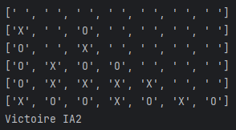

# Connect4

## Overview
Connect4 is a python project that allows user to play connect four against computer using Monte Carlo Tree Search algorithm.

## Requirements

- pygame

## About MCTS
In computer science, Monte Carlo tree search (MCTS) is a heuristic search algorithm for some kinds of decision processes, most notably those employed in software that plays board games. In that context MCTS is used to solve the game tree. 

## Future Improvements
- Adding UI 
