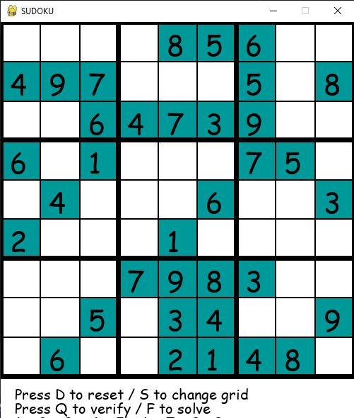

# Sudoku

## Overview
Sudoku is a python project that generates sudoku's grid and allow to play on them. The project uses pygame library for the UI.

## Features

- Generates grids based on given difficulty

- UI to play on grid

## Requirements

- pygame

## Contributing
Contributions are welcome! Feel free to submit a Pull Request or raise an issue if you find any bugs or have suggestions for improvements.

## License
This project is licensed under the MIT License. See the LICENSE file for more details.